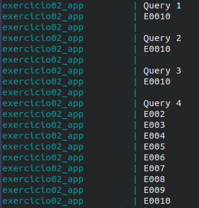

Prova N**
============
Exercícios propostos para prova da empresa N, utilizando .NET Core 3.1, Swagger Tools, XUnit, MSSQL Server 2019 Linux, Docker e Docker Compose 

## Questão 1)

R: Ao Quadrado, vide testes

## Questão 2)

Console App utilizando .NET Core 3.1, Docker, Docker-Compose

<p align="center">

</p>

### Instruções para execução

```
docker-compose up --build exercicio02.app
```

R: C1 + C2 + C3

## Questão 3)

Web API utilizando .NET Core 3.1 + Health Check + Swagger UI + Fluent Validation, Redis, XUnit, Docker, Docker-Compose,
 
<p align="center">

</p>
<p align="center">
 
</p>

### Instruções para execução

```
docker-compose up --build exercicio03.api
```

Para obter o IP do container

```
docker inspect --format='{{range .NetworkSettings.Networks}}{{.IPAddress}}{{end}}' exercicio03_api
```

Copie o endereço de IP obtido no comando acima e cole no navegador :)